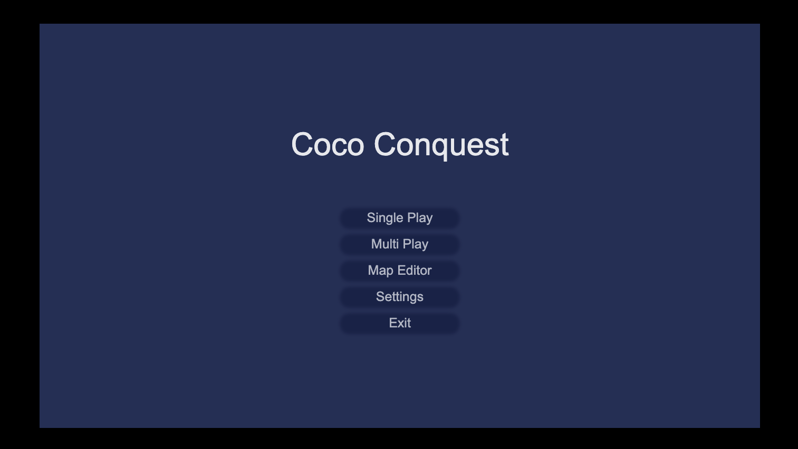
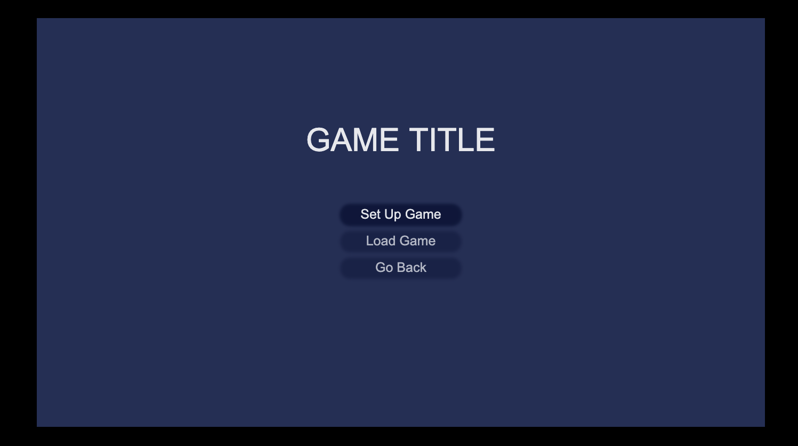
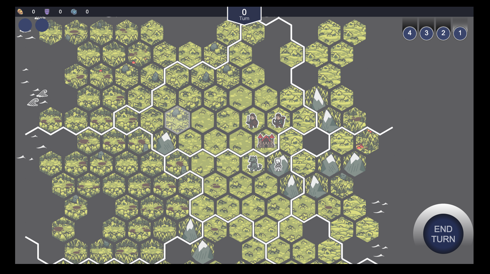
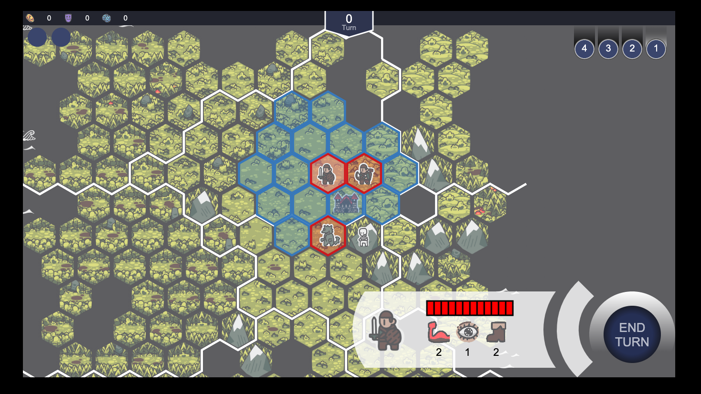
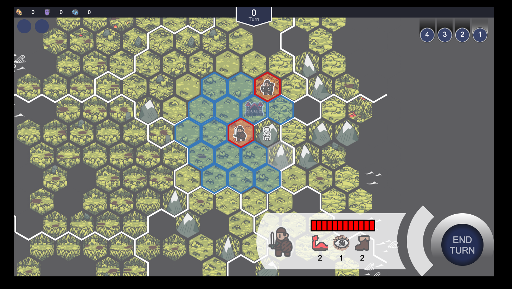
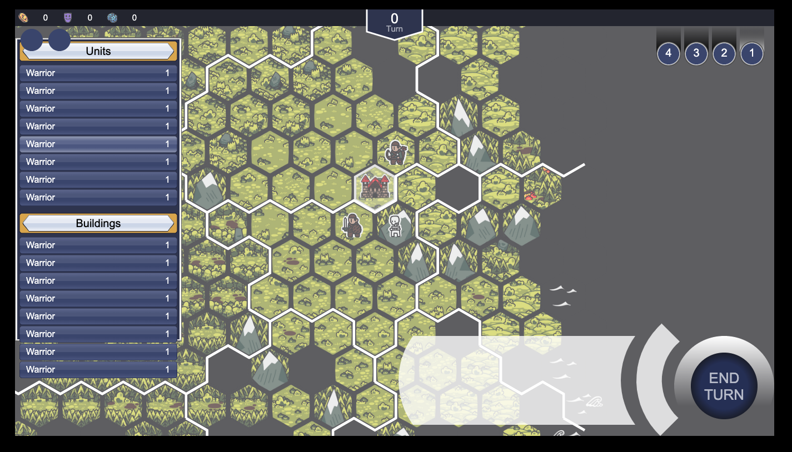

# Coco Conquest
Personal game made using pure Javascript Canvas API (without any game engine). Due to many limitations, I have stopped working on this project. Quite a bit of effort was put on this project though, including:
1. Dealing with hexagonal grids and determining its boundary (ex. whether the mouse is over the hex)
2. Coming up with algorithm to generate random map for each game
3. Path finding algorithm for determining where the unit can move to

and many more small details.

## Other stories
Halfway through the project, I recognized how difficult it would be continue with this project unless I have a proper library to make the game with. I tried using Canvas library called konva, but it turned out that using konva actually slowed down the game to the point that it was unplayable (That's when I stopped working on this project.)

By the way, I also utilized tauri for porting the game to a desktop application.

## Tech Used
- ecsy: ECS architecture for game design
- webpack: For bundling code
- eslint: For linting
- web socket: For bidirectional network requests

## Brief Explanation on Directory
1. client: this folder is where all the source code for the game is at
2. client_konva: another implementation using konva
3. server: used for web socket

## Set Up
1. `npm install`
2. `npm start`

## Screenshots

